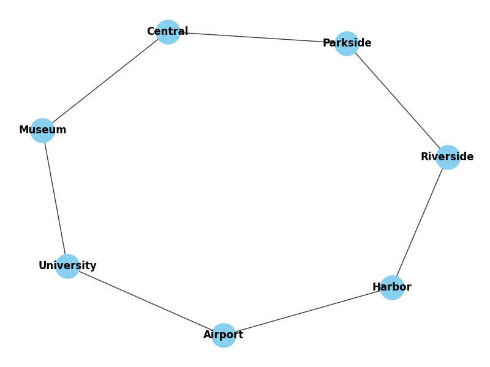

# Завдання 1: Модель реальної мережі

## Опис
Модель спрощеної міської транспортної мережі — станції метро як вершини, з’єднання як ребра.

## Візуалізація

## Основні характеристики
- Кількість вершин: **7**
- Кількість ребер: **7**
- Ступінь вершин:
  - Central: 2
  - Parkside: 2
  - Museum: 2
  - Riverside: 2
  - University: 2
  - Airport: 2
  - Harbor: 2
- Середній ступінь вершини: **2.00**
- Ізольовані вершини: **відсутні**

## Висновок
Мережа зв’язна, кожна станція має принаймні одне з’єднання; структура рівномірна.